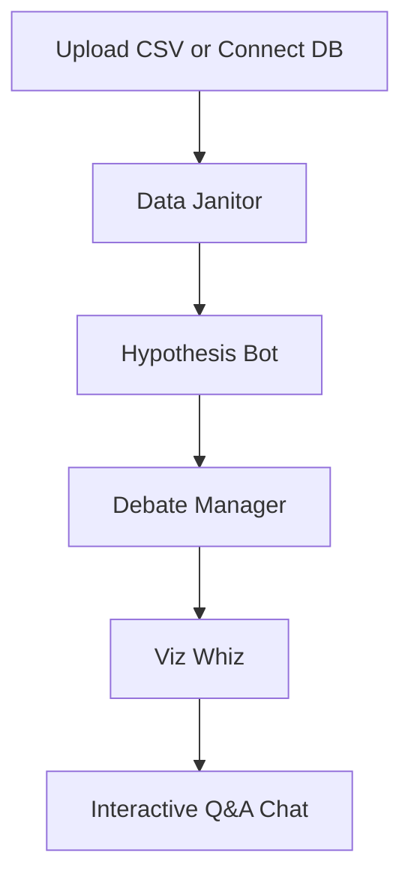

# Insight Orchestra 🤖

<div align="center">


*Self-hostable, transparent code execution, unlimited local usage, private LLMs via Ollama*


*(Live demo coming soon!)*

</div>

---

## 🧠 Core Principles

Insight Orchestra is built on a foundation of privacy and transparency. Unlike cloud-based black-box solutions, we prioritize:

- **�️ 100% Privacy**: Run everything locally using Ollama. Your data never leaves your infrastructure.
- **🧬 Full Transparency**: Every Python command generated by the AI is available for review before execution.
- **� Flexible Connectivity**: Native support for DuckDB, PostgreSQL, MySQL, SQLite, and CSV files.
- **⚡ Local-First Cost**: No monthly subscriptions. Unlimited analysis using your own local hardware.

---

## 🚀 Quick Start

### Docker Compose (Recommended)

```bash
# Clone the repository
git clone https://github.com/laban254/insight-orchestra.git
cd insight-orchestra

# Copy environment file
cp .env.example .env

# Start all services (Backend, Frontend, Ollama)
docker-compose up -d --build
```

- **Frontend**: http://localhost:8501
- **Backend API**: http://localhost:8000

---

## 🤖 The Agent Orchestra

Insight Orchestra leverages a structured Multi-Agent pipeline where specialized agents collaborate to analyze your data:

1. **� Data Janitor**: More than just cleaning; it infers schemas, imputes missing values using statistical modes, and proactively flags data biases (e.g., high missingness in critical columns).
2. **🧪 Hypothesis Bot**: Generates testable, non-trivial hypotheses by looking for interactions, groupings, and trends within your dataset.
3. **🧠 Debate Manager**: Acts as a quality filter, scoring hypotheses based on statistical confidence and business impact to ensure only the most valuable insights are pursued.
4. **📊 Viz Whiz**: Automatically selects the best visualization (Scatter, Box, Violin, etc.) to represent the consensus hypothesis using Plotly.



---

## 💬 Example Queries

- *"What is the average salary by department?"*
- *"Show me a bar chart of sales by region."*
- *"Find correlations between age and income."*
- *"Which columns have missing values, and how should we treat them?"*

---

## �️ Tech Stack

| Category | Technologies |
|----------|--------------|
| **Frontend** | **Next.js 14**, React, Tailwind CSS, shadcn/ui, Monaco Editor, Plotly.js |
| **Backend** | **Python**, FastAPI, Pandas, DuckDB, RestrictedPython (Sandbox) |
| **AI Infrastructure** | **ADK** (Agent Development Kit), LangChain, Ollama, OpenAI |
| **Data Adapters** | PostgreSQL, MySQL, SQLite, CSV |

---

## 🤝 Contributing

Contributions are welcome! To help us build the best open-source data analyst:
1. Check out our [Issue Templates](.github/ISSUE_TEMPLATE/).
2. Review the Architecture in our [Walkthrough](/docs/blog_post.md).
3. Submit a PR! Our robust CI Pipeline guarantees safe integration.

---

## 📝 License & Contact

**License**: Apache 2.0 License. See [LICENSE](LICENSE) for details.
**Author**: [@laban254](https://github.com/laban254) | labanrotich6544@gmail.com
