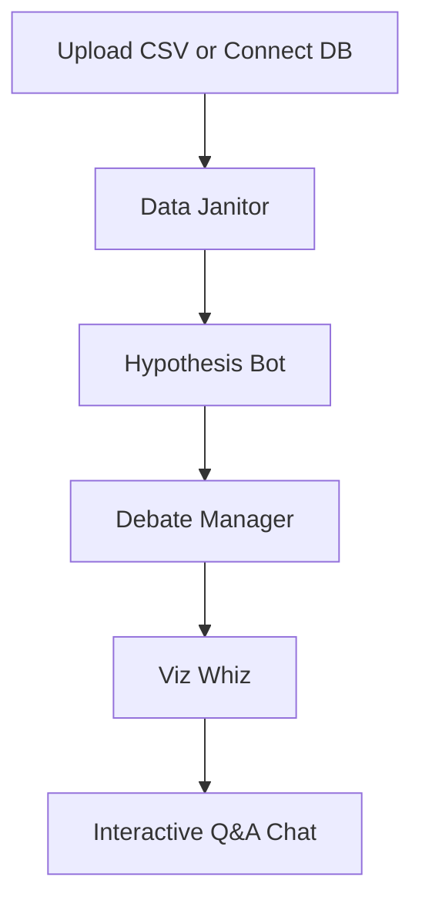

# Insight Orchestra 🤖

<div align="center">


*Self-hostable, transparent code execution, unlimited local usage, private LLMs via Ollama*


*(Live demo coming soon!)*

</div>

---

## ✨ Core Principles

Insight Orchestra is built on a foundation of privacy, transparency, and capability. We prioritize:

- **🛡️ 100% Privacy**: Run everything locally using Ollama. Your data never leaves your infrastructure.
- **🔍 Full Transparency**: Every Python command generated by the AI is available for review before execution.
- **🌐 Flexible Connectivity**: Native support for DuckDB, PostgreSQL, MySQL, SQLite, and CSV files.
- **💎 Unlimited & Self-Hosted**: No monthly subscriptions. Full control over your analysis using your own hardware.

---

## ✨ Key Features

- **Multi-Agent Pipeline**: 4 specialized agents (Data Janitor, Hypothesis Bot, Debate Manager, Viz Whiz) collaborate to analyze your data intelligently
- **Multi-Database Support**: PostgreSQL, MySQL, SQLite, DuckDB, and CSV files
- **Local LLM Integration**: Full support for Ollama—run open-source models like Llama 2 locally
- **Sandboxed Execution**: RestrictedPython prevents malicious code execution while allowing full data analysis capabilities
- **Natural Language Queries**: Ask questions in plain English, get Python/SQL code + results
- **Interactive Visualizations**: Auto-selected charts using Plotly with drill-down capabilities
- **Session Management**: Persist analysis sessions, export results as CSV/JSON/PDF
- **Production-Ready UI**: Next.js 14 frontend with real-time updates and responsive design
- **Hypothesis Scoring**: Automated quality filtering based on statistical confidence and business impact

---

## 💻 System Requirements

**Minimum**:
- CPU: 2+ cores
- RAM: 4GB (8GB recommended for local LLMs)
- Disk: 2GB free space
- Python: 3.11+
- Docker & Docker Compose (for containerized deployment)

**For Local LLM (Ollama)**:
- RAM: 8GB+ recommended (models range from 3.8GB to 13GB)
- GPU support optional but recommended (NVIDIA CUDA or AMD ROCm)

---

## 🚀 Quick Start

### Option 1: Docker Compose (Recommended)

```bash
# Clone the repository
git clone https://github.com/laban254/insight-orchestra.git
cd insight-orchestra

# Copy environment file
cp .env.example .env

# Start all services (Backend, Frontend, Ollama)
docker-compose up -d --build
```

**Access Points**:
- **Frontend**: http://localhost:3000
- **Backend API**: http://localhost:8000
- **Swagger Docs**: http://localhost:8000/docs
- **Ollama**: http://localhost:11434

### Option 2: Local Development

For step-by-step setup instructions, see [Local Development Setup](docs/SETUP.md)


---

## 📚 Documentation Hub

Complete guides for using and developing Insight Orchestra:

| Document | Purpose |
|----------|----------|
| **[SETUP.md](docs/SETUP.md)** | Step-by-step local development setup |
| **[ARCHITECTURE.md](docs/ARCHITECTURE.md)** | System design, components, and data flow |
| **[AGENTS.md](docs/AGENTS.md)** | Deep dive into the 4-agent pipeline |
| **[API_REFERENCE.md](docs/API_REFERENCE.md)** | REST endpoints, examples, and error handling |

**Quick Links**:
- Interactive API Docs: http://localhost:8000/docs (after running backend)
- Environment Setup: [SETUP.md](docs/SETUP.md#-environment-configuration)

---

## 🔧 The Multi-Agent Pipeline

Insight Orchestra uses 4 specialized agents that work together:

1. **🛠️ Data Janitor** - Cleans data, detects issues, flags biases
2. **🔎 Hypothesis Bot** - Generates insights using LLM analysis
3. **🧠 Debate Manager** - Scores and ranks hypotheses by business value
4. **✨ Viz Whiz** - Auto-selects and creates visualizations

**[Learn how they work →](docs/AGENTS.md)**



---

## 💬 What You Can Do

- **Ask Questions**: *"What is the average salary by department?"*
- **Get Visualizations**: *"Show me a bar chart of sales by region."*
- **Find Patterns**: *"Find correlations between age and income."*
- **Understand Data**: *"Which columns have missing values, and how should we treat them?"*
- **Connect Databases**: Query PostgreSQL, MySQL, SQLite, or DuckDB in real-time
- **Export Results**: Save findings as CSV, JSON, Parquet, or PDF

---

## ⚙️ Tech Stack

| Layer | Technologies |
|-------|--------------|
| **Frontend** | Next.js 14, React, Tailwind CSS, shadcn/ui, Plotly.js |
| **Backend** | Python 3.11+, FastAPI, Pandas, DuckDB |
| **AI/Agents** | Google ADK, LangChain, Ollama, OpenAI |
| **Security** | RestrictedPython (sandboxed execution) |
| **Data** | PostgreSQL, MySQL, SQLite, DuckDB, CSV |
| **Deployment** | Docker, Docker Compose |

---

## 🤝 Contributing

Contributions are welcome! To help us build the best open-source data analyst:

1. **Read First**: [Contributing Guide](CONTRIBUTING.md)
2. **Understand the System**: [ARCHITECTURE.md](docs/ARCHITECTURE.md)
3. **Set Up Locally**: [SETUP.md](docs/SETUP.md)
4. **Learn the Agents**: [AGENTS.md](docs/AGENTS.md)
5. **Submit PR**: Fork, create a feature branch, and submit with tests

Our CI Pipeline validates all changes automatically.

---

## 📝 License & Contact

**License**: Apache 2.0 License. See [LICENSE](LICENSE) for details.
**Author**: [@laban254](https://github.com/laban254) | labanrotich6544@gmail.com
