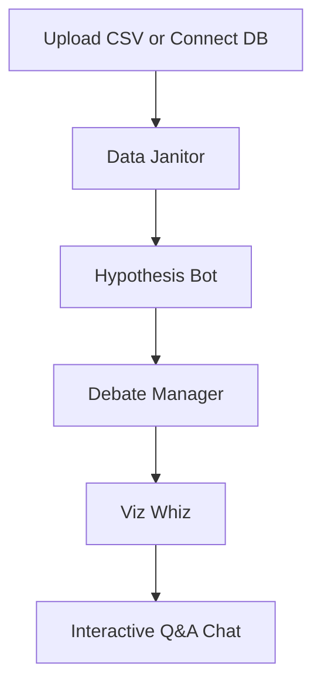

# Insight Orchestra 🎻

<div align="center">


*Self-hostable, transparent code execution, unlimited local usage, private LLMs via Ollama*


*(Live demo coming soon!)*

</div>

---

## ✨ Why Insight Orchestra?

Many AI data analysis tools process your data on remote servers or obscure the underlying analysis. Insight Orchestra runs four specialized AI agents locally on your machine, ensuring data privacy, explicit code visibility, and complete control over the analytical workflow.

| Feature | Insight Orchestra | Julius AI / Cloud Alternatives |
|---------|--------------------|---------------------------------|
| **Execution** | **Local & Self-Hosted** | Cloud-based |
| **Data Privacy** | **100% Private (Ollama support)** | Stored on third-party servers |
| **Transparency** | **Review every Python command** | Black-box execution |
| **Connectors** | **DuckDB, Postgres, MySQL, SQLite, CSV** | Varies |
| **Pipelines** | **Multi-Agent visualised workflow** | Hidden inference |
| **Cost** | **Free forever (Local)** | Subscription based ($20+/mo) |

---

## 🚀 Quick Start

### Docker Compose (Recommended)

```bash
# Clone the repository
git clone https://github.com/laban254/insight-orchestra.git
cd insight-orchestra

# Copy environment file
cp .env.example .env

# Start all services (Backend, Frontend, Ollama)
docker-compose up -d --build
```

- **Frontend**: http://localhost:8501
- **Backend API**: http://localhost:8000

---

## 📊 How It Works

Insight Orchestra leverages a structured Multi-Agent pipeline to deliver accurate results:



1. **Data Janitor**: Cleans duplicates, infers schema, imputes missing values.
2. **Hypothesis Bot**: Generates testable, statistically sound hypotheses.
3. **Debate Manager**: Scores hypotheses based on precision and business value.
4. **Viz Whiz**: Auto-generates interactive Plotly visualizations.

---

## 🔍 Example Queries

- *"What's the average salary by department?"*
- *"Show me a bar chart of sales by region."*
- *"Find correlations between age and income."*
- *"Which columns have missing values, and how should we treat them?"*

---

## 💻 Tech Stack

- **Frontend**: Next.js 14, React, Tailwind CSS, shadcn/ui, Monaco Editor, Plotly.js
- **Backend**: Python, FastAPI, Pandas, DuckDB/PostgreSQL adapters
- **AI Infrastructure**: ADK (Agent Development Kit), LangChain, Ollama, OpenAI

---

## 🤝 Contributing

Contributions are welcome! To help us build the best open-source data analyst:
1. Check out our [Issue Templates](.github/ISSUE_TEMPLATE/).
2. Review the Architecture in our [Walkthrough](/docs/blog_post.md).
3. Submit a PR! Our robust CI Pipeline guarantees safe integration.

---

## 📝 License & Contact

**License**: Apache 2.0 License. See [LICENSE](LICENSE) for details.
**Author**: [@laban254](https://github.com/laban254) | labanrotich6544@gmail.com
