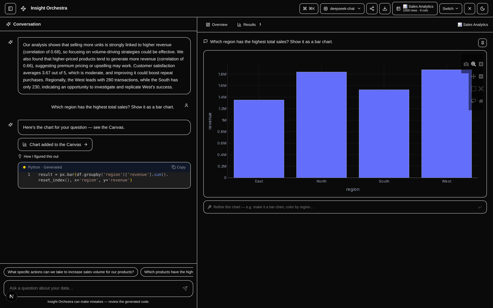

<h1 align="center">Insight Orchestra</h1>

<p align="center"><strong>Your data, analyzed by a team of AI agents.</strong></p>

<p align="center">
  Connect a CSV or database and watch specialized agents clean it, form hypotheses,<br/>
  debate them, and visualize what matters — then ask follow-ups in plain English.
</p>

<p align="center">
  <a href="https://insight-orchestra-io.lovable.app">Website</a> ·
  <a href="docs/">Docs</a> ·
  <a href="https://github.com/laban254/insight-orchestra/issues/new">Report a bug</a>
</p>

<p align="center">
  <a href="https://github.com/laban254/insight-orchestra/actions/workflows/ci.yml"></a>
  <a href="https://github.com/laban254/insight-orchestra/actions/workflows/codeql.yml"></a>
  <a href="https://github.com/laban254/insight-orchestra/releases"></a>
  <a href="LICENSE"></a>
  <a href="https://github.com/laban254/insight-orchestra/stargazers"></a>
  <a href="https://codespaces.new/laban254/insight-orchestra"></a>
</p>



---

## What is Insight Orchestra?

Insight Orchestra is an **open-source AI data analyst you can self-host** — think Julius AI or ChatGPT's data analysis, but running on your own hardware, with your choice of LLM, where your data never leaves your machine. Upload a CSV or connect a database, and a 4-agent pipeline cleans the data, generates evidence-backed hypotheses, scores them in an LLM-refereed debate, and builds interactive Plotly charts. Then keep asking questions in plain English: an NLQ agent writes pandas code and executes it in a locked-down sandbox.

It works with **your choice of LLM** — OpenAI, Anthropic, or DeepSeek in the cloud, or fully local and private with Ollama.

## Quick Start

**Prerequisites:** Docker & Docker Compose v2 · Git · 4 GB RAM (8 GB recommended for local LLMs)

One line, clones into `./insight-orchestra` and runs the setup wizard:

```bash
curl -fsSL https://raw.githubusercontent.com/laban254/insight-orchestra/main/install.sh | bash
```

Or clone it yourself first:

```bash
git clone https://github.com/laban254/insight-orchestra.git
cd insight-orchestra
./setup.sh
```

The script asks which LLM provider to use (Ollama by default — local, private, no API key needed), writes `backend/.env`, starts the containers, and pulls the Ollama model automatically. Run it again any time; it won't clobber an existing `backend/.env` without asking.

Fully non-interactive (works with either path above — pass the flags after `bash -s --` for the curl one-liner):

```bash
./setup.sh --provider ollama -y                        # local, no API key
./setup.sh --provider openai --api-key sk-... -y       # or anthropic / deepseek

# equivalent, without cloning first:
curl -fsSL https://raw.githubusercontent.com/laban254/insight-orchestra/main/install.sh | bash -s -- --provider ollama -y
```

Something not working? `./setup.sh doctor` checks Docker, ports, config, and running services. Prefer to configure `backend/.env` by hand instead? See the [Setup Guide](docs/SETUP.md).

### Open the app

Once `./setup.sh` finishes:

| Service | URL |
|---------|-----|
| Frontend | http://localhost:8501 |
| Backend API | http://localhost:8000 |
| Swagger Docs | http://localhost:8000/docs |

Pick one of the five bundled demo datasets (or upload your own CSV) and the pipeline runs automatically.

## How It Works

The pipeline runs the moment you upload or select a dataset. Results — narrative, ranked insights, charts, suggested follow-ups — appear in the chat as the first message.

| Stage | Agent | Function |
|-------|-------|----------|
| 1 | **Data Janitor** | Removes duplicates; imputes missing values (median for numeric, mode for categorical); flags bias (>30% missing); detects outliers via IQR |
| 2 | **Hypothesis Bot** | Builds descriptive statistics + correlations, then asks the LLM to generate 5–8 specific, directional, evidence-backed insights referencing actual column names and numbers |
| 3 | **Debate Manager** | LLM scores each hypothesis on `confidence` and `business_value` (0–1) using the real data stats as evidence; sorts by combined score; selects consensus winner |
| 4 | **Viz Whiz** | Asks the LLM which columns best illustrate the top insight; falls back to regex extraction then structured heuristics; generates up to 6 Plotly charts |
| 5 | **Insight Summarizer** | LLM writes a 3–5 sentence narrative summarising all findings; generates 4–5 specific follow-up questions using actual column names |

Each stage streams real-time progress to the UI via SSE. See the [Agent Pipeline Guide](docs/AGENTS.md) for the full breakdown.

## Features

- **Natural Language Queries** — the NLQ agent generates pandas code, executes it in the RestrictedPython sandbox, and returns results + optional Plotly charts
- **Four LLM Providers** — OpenAI, Anthropic, DeepSeek, or Ollama (any locally-hosted model); switch provider/model at runtime, no restart needed
- **Multi-Database Support** — PostgreSQL, MySQL, SQLite, DuckDB, BigQuery, and CSV — all read-only with SQL injection protection
- **Sandboxed Code Execution** — no file I/O, no network access, no dangerous imports; configurable timeout
- **Real-Time Agent Progress** — SSE streaming shows each agent's status, output, and duration
- **Workspace, Share & Export** — pin and compare charts, workspace history saved server-side (reopen past runs from any browser), one-click read-only share links (72 h TTL), export as HTML / Markdown / CSV with embedded interactive charts
- **5 Demo Datasets** — try it without bringing your own data

## Documentation

| Document | Purpose |
|----------|---------|
| [Setup Guide](docs/SETUP.md) | Docker and local development setup, troubleshooting |
| [Architecture](docs/ARCHITECTURE.md) | System design, component breakdown, data flow |
| [Agent Pipeline](docs/AGENTS.md) | Deep dive into all 4 agents + NLQ agent |
| [API Reference](docs/API_REFERENCE.md) | All REST endpoints with request/response examples |

## Roadmap

Near-term focus is correctness and hardening: CI builds from a clean cache, rate limiting, input validation, and broader test coverage. Further out: more data formats (Excel, JSON, Parquet), saved dashboards, and PDF export. Have a request or want to influence priorities? [Open an issue](https://github.com/laban254/insight-orchestra/issues).

## Contributing

Contributions are welcome — the [Contributing Guide](CONTRIBUTING.md) covers the development workflow, code style, and how to add a new agent to the pipeline.

If Insight Orchestra is useful to you, consider **starring the repo** — it helps others find the project.

## License

Apache 2.0 — see [LICENSE](LICENSE).

**Author:** [@laban254](https://github.com/laban254)
